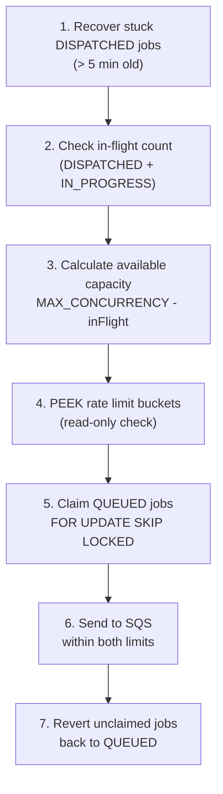
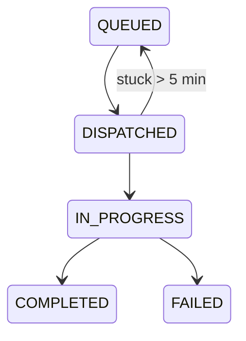
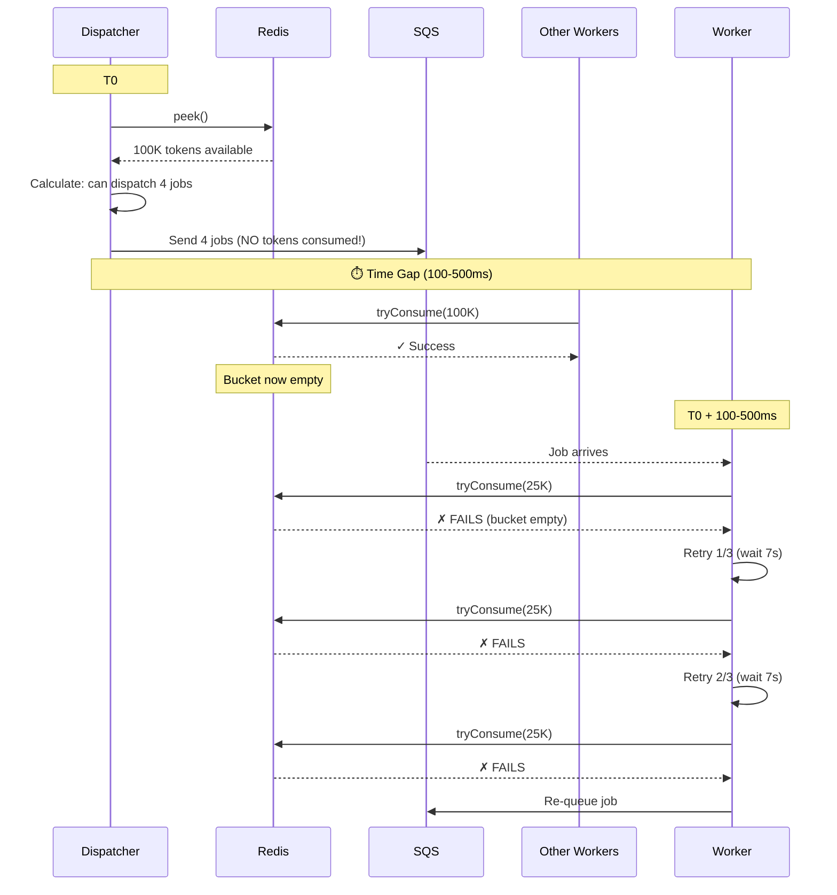

When you're running AI agents in production, the hardest problems aren't the AI parts — they're the boring infrastructure parts. I learned this the hard way while building the account research system at **[Winrate](https://winrate.com)**.


# The Problem

Our research system uses AI agents to gather information about companies. Each job calls multiple rate-limited APIs — LLM providers for reasoning, web search APIs for real-time data, and enrichment APIs for company information.

Running on **AWS Lambda** with **SQS** triggers, we had dozens of concurrent workers processing jobs. The naive approach was simple:

```typescript
async function processJob(job: Job) {
  const research = await llmClient.chat({ ... }) // Hope we don't hit 429!
  const search = await searchApi.query({ ... }) // Hope we don't hit 429!
}
```

The result was predictable: **429 errors everywhere**, wasted API calls, failed jobs, and unhappy customers. We needed coordination without single points of failure.

I spent months building two critical pieces of infrastructure: a distributed rate limiter using **Redis** and **Lua scripts**, and a backpressure-aware job dispatcher. These patterns apply to any system running multiple AI agents against rate-limited APIs.

# Part 1: Distributed Rate Limiting with Redis

## Why Token Buckets?

The token bucket algorithm handles both sustained load and burst capacity. Tokens refill at a constant rate (thousands per minute for LLM RPM), and accumulated tokens allow temporary spikes.

For LLM APIs, we need **two buckets per provider**:
- **RPM bucket** — Requests per minute (prevents too many API calls)
- **TPM bucket** — Tokens per minute (prevents burning through quota with large prompts)

## The Redis Challenge: Atomicity

The naive implementation has a fatal flaw:

```typescript
// WRONG: Race conditions everywhere
async function tryConsume(tokens: number): Promise<boolean> {
  const available = await redis.get('bucket:tokens')
  if (available >= tokens) {
    await redis.set('bucket:tokens', available - tokens)
    return true
  }
  return false
}
```

Between the `get` and `set`, another Lambda container can read the same value, and both think they have capacity. With many concurrent workers, this is guaranteed to cause over-consumption.

Redis transactions (`MULTI/EXEC`) don't help here because they're not truly atomic — they just batch commands. What we need is **Lua scripting**.

## Atomic Token Bucket with Lua

Lua scripts in Redis execute atomically on a single thread. Here's the core consume operation:

```lua
local rpm_key = KEYS[1]
local tpm_key = KEYS[2]
local rpm_cost = tonumber(ARGV[1])
local tpm_cost = tonumber(ARGV[2])
local rpm_limit = tonumber(ARGV[3])
local tpm_limit = tonumber(ARGV[4])
local now = tonumber(ARGV[7])
local window_ms = 60000

-- Get current state or initialize
local rpm_data = redis.call('HMGET', rpm_key, 'tokens', 'last_refill')
local rpm_tokens = tonumber(rpm_data[1]) or rpm_limit
local rpm_last_refill = tonumber(rpm_data[2]) or now

-- Calculate refill since last access
local rpm_elapsed = now - rpm_last_refill
local rpm_refill = math.floor(rpm_elapsed * refill_rate_rpm / window_ms)
rpm_tokens = math.min(rpm_limit, rpm_tokens + rpm_refill)

-- TPM pre-check: verify TPM capacity BEFORE consuming RPM
-- This prevents partial consumption scenarios
local tpm_data = redis.call('HMGET', tpm_key, 'tokens', 'last_refill')
local tpm_tokens = tonumber(tpm_data[1]) or tpm_limit

-- Check both buckets before consuming either
if rpm_tokens < rpm_cost or tpm_tokens < tpm_cost then
  return cjson.encode({ success = false, retry_after_ms = calculated_wait })
end

-- Consume from both buckets atomically
rpm_tokens = rpm_tokens - rpm_cost
tpm_tokens = tpm_tokens - tpm_cost

redis.call('HMSET', rpm_key, 'tokens', rpm_tokens, 'last_refill', now)
redis.call('HMSET', tpm_key, 'tokens', tpm_tokens, 'last_refill', now)

return cjson.encode({ success = true, rpm_remaining = rpm_tokens })
```

The key insight: **check both buckets before consuming either**. If we consumed RPM first and then TPM failed, we'd waste an RPM token.

## Fail-Open: A Critical Design Decision

Here's where it gets interesting. What happens when Redis goes down?

```typescript
export class TokenBucket {
  private circuitBreakerFailures = 0

  async tryConsume(rpmCost: number, tpmCost: number): Promise<ConsumeResult> {
    if (this.isCircuitOpen()) {
      // Fail-open: allow the request to proceed
      return { success: true, failedOpen: true }
    }

    try {
      const result = await this.redis.eval(this.consumeScript, ...)
      this.resetCircuitBreaker()
      return JSON.parse(result)
    } catch (error) {
      this.recordCircuitBreakerFailure()
      return { success: true, failedOpen: true }
    }
  }
}
```

We **fail-open** when Redis is unavailable. This feels counterintuitive, but here's the reasoning:

- **Rate limiting is optimization, not authorization** — unlike auth checks, rate limiting protects external APIs from us, not our users from unauthorized access
- **External APIs have their own limits** — if Redis fails and we over-call the LLM API, we'll get 429s anyway
- **Jobs shouldn't hang** — with many Lambda containers, any Redis hiccup would instantly halt all processing

The alternative — failing closed — means Redis outages cascade into complete system failure. That's worse.

## What Happens When Workers Hit Rate Limits

When a worker hits a rate limit, it doesn't just fail. It retries 3 times with backoff within the same Lambda execution. If still rate limited, it **re-queues** the job back to SQS with a delay:

```typescript
const delaySeconds = Math.min(
  Math.ceil(error.retryAfterMs / 1000),
  SQS_MAX_DELAY_SECONDS  // 900 seconds - AWS hard limit
);

await sqs.send(new SendMessageCommand({
  QueueUrl: process.env.QUEUE_URL,
  MessageBody: JSON.stringify({
    jobType: 'account-research',
    payload: { ...payload, requeue_attempts: currentAttempts + 1 },
  }),
  DelaySeconds: delaySeconds,
}));
```

This can happen up to **500 times** before the job finally fails. At 15 minutes max delay per requeue, that's theoretically ~125 hours of retry capacity. In practice, most jobs succeed within a few requeues — but the overhead adds up.

There's also SQS **visibility timeout** to consider: set to 16 minutes (must exceed Lambda's 15-minute max timeout). If a Lambda dies mid-processing, SQS will make the message visible again after 16 minutes. Without this, orphaned messages would stay invisible forever.

This requeue cascade is exactly why we needed better orchestration — which leads us to the dispatcher pattern.

# Part 2: Backpressure-Aware Job Dispatching

Rate limiting prevents us from over-calling APIs once jobs are running. But we have another problem: **job dispatch itself**.

## The Problem: Queue Flooding

With SQS triggering Lambda directly:

```typescript
// What NOT to do
new SqsEventSource(queue, {
  batchSize: 10,
  maxConcurrency: 50,
})
```

When 1,000 jobs land in the queue, Lambda immediately spins up dozens of containers and starts processing. All of them hit the rate limiter simultaneously. Most get rejected, retry after backoff, and the whole system thrashes.

What we need is **backpressure**: don't dispatch jobs faster than we can process them.

## The Dispatcher Pattern

Instead of letting SQS trigger Lambda directly, we introduce a dispatcher Lambda that runs on a schedule:



## Job Status State Machine

The key insight is adding a **DISPATCHED** intermediate status:



This separation enables:
- **Stuck job recovery** — if a job stays DISPATCHED > 5 minutes, something went wrong. Revert to QUEUED.
- **Accurate capacity calculation** — we know exactly how many jobs are in-flight
- **Frontend simplicity** — map DISPATCHED → QUEUED in API responses. Users don't need to see internal states.

## Atomic Job Claiming with PostgreSQL

Multiple dispatcher instances could race to claim the same jobs. We prevent this with `FOR UPDATE SKIP LOCKED`:

```typescript
async function claimQueuedJobs(limit: number): Promise<Job[]> {
  const result = await db.query(`
    UPDATE research_jobs
    SET job_status = 'DISPATCHED', modified_at = NOW()
    WHERE id IN (
      SELECT id
      FROM research_jobs
      WHERE job_status = 'QUEUED'
      ORDER BY queued_at
      FOR UPDATE SKIP LOCKED
      LIMIT $1
    )
    RETURNING *
  `, [limit])

  return result.rows
}
```

**FOR UPDATE** locks selected rows. **SKIP LOCKED** skips rows locked by other transactions instead of waiting. This gives us contention-free claiming.

## Singleton Dispatcher

We run exactly one dispatcher at a time using Lambda reserved concurrency:

```typescript
const dispatcherLambda = new Function(this, 'JobDispatcher', {
  reservedConcurrentExecutions: 1,  // Only one instance ever
  timeout: Duration.seconds(60),
})

new Rule(this, 'DispatcherSchedule', {
  schedule: Schedule.rate(Duration.minutes(1)),
  targets: [new LambdaFunction(dispatcherLambda)],
})
```

One dispatcher per minute is sufficient for our throughput needs and eliminates complexity.

# Part 3: The Race Condition We Didn't Expect

After deploying the dispatcher, we ran our first large-scale test: **12,000 research jobs**. The results were illuminating — and revealed a subtle race condition.

## Production Results

| Metric | Before Dispatcher | After Dispatcher | Improvement |
|--------|-------------------|------------------|-------------|
| Jobs processed | 200 | 6,892 | - |
| Rate limit exhaustions | 1,059 | 6,713 | - |
| Worker retry attempts | 6,083 | 28,701 | - |
| **Retries per job** | **30.4** | **4.16** | **86% reduction** |

The dispatcher reduced retries per job by 86% — a massive improvement. But we still saw 28,701 retry attempts for 6,892 completed jobs. Something was still wrong.

## The Peek vs Consume Race

The problem lies in the time gap between dispatcher and worker:



The dispatcher uses `peek()` (read-only) to check capacity, but workers use `tryConsume()` (atomic consumption). Between the peek and the consume, other workers can drain the bucket.

Damn. I didn't see this coming.

## The Fix: Reserve Tokens at Dispatch

The solution is conceptually simple: the dispatcher should **reserve** tokens when dispatching, not just peek. Workers then release unused tokens if they fail for non-rate-limit reasons.

```typescript
// Dispatcher: reserve tokens (not just peek)
const reservation = await rateLimitManager.tryConsume(service, requirement.tpm);
if (!reservation.success) {
  await revertJobToQueued(job.id);
  continue;
}

await sendToSQS(job, { reservationId: reservation.id });

// Worker: tokens already consumed, just execute
// On non-rate-limit failure: refund tokens
if (error && !isRateLimitError(error)) {
  await rateLimitManager.refund(reservation.id);
}
```

Based on our 12K run data, this should reduce retries from 4.16 per job to ~0.1 per job — a 97% reduction. The remaining retries would only occur for genuine external API 429s we can't predict.

# Lessons Learned

After months of building and debugging this system, here's what stuck with me:

- **Lua scripts are essential for Redis atomicity.** `MULTI/EXEC` isn't enough when you need conditional logic. Don't fight it — just write the Lua.

- **Fail-open for rate limiting, fail-closed for auth.** Know the difference between "this protects us" and "this protects our users."

- **Intermediate job states enable recovery.** The DISPATCHED status seems like overhead until you need to recover stuck jobs at 3 AM.

- **Peek before consume has a catch.** Non-destructive capacity checks enable smarter scheduling, but they're inherently stale by the time workers act on them. Sometimes you need to reserve, not just peek.

- **Database locks scale better than distributed locks.** `FOR UPDATE SKIP LOCKED` in PostgreSQL is simpler and more reliable than distributed locking with Redis.

- **Test at scale early.** Our 200-job tests looked perfect. The 12,000-job test revealed the race condition. You can't always predict what breaks at scale, but you can find out sooner.


# What's Next

The peek-vs-consume race condition taught me that even well-designed systems reveal edge cases at scale. The reservation-based fix is our next iteration — and likely not our last.

Building production-grade AI agent infrastructure is an exercise in distributed systems fundamentals: atomicity, backpressure, and graceful degradation. These patterns apply to any system coordinating multiple workers against rate-limited APIs.

If you're building something similar and want to chat, reply in the comments or find me on [LinkedIn](https://linkedin.com/in/evekeen).
